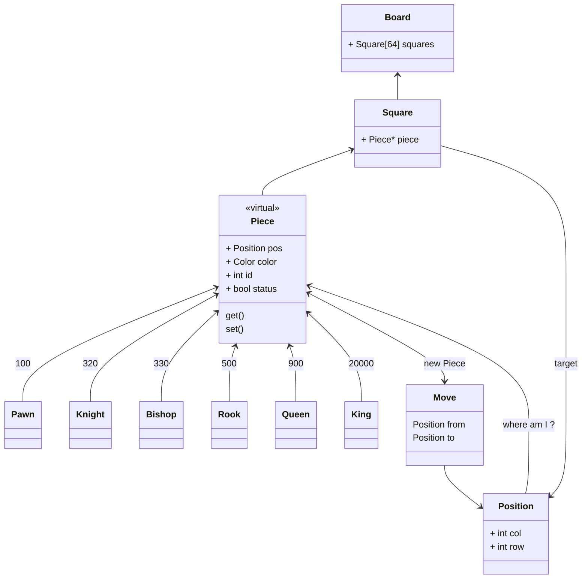
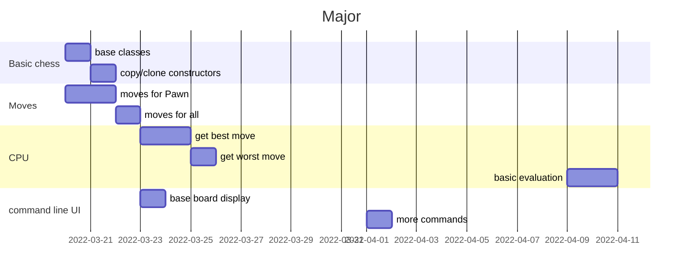

#  Chess Game in C++

[](https://docs.microsoft.com/en-us/windows/wsl/tutorials/gui-apps)
[](https://github.com/ThomasByr/chess/blob/master/LICENSE)
[](https://GitHub.com/ThomasByr/chess/commit/)
[](https://gitHub.com/ThomasByr/chess/commit/)
[](https://GitHub.com/ThomasByr/chess/graphs/commit-activity)

[](https://github.com/ThomasByr/chess/actions/workflows/codeql.yml)
[](https://github.com/ThomasByr/chess)
[](https://github.com/ThomasByr)

<summary>School project</summary>

> [Project instruction paper](https://moodle.unistra.fr/pluginfile.php/748157/mod_resource/content/11/td-echecs.html) (subject) on the Moodle page.

**If you ever get this in .7z, .zip, .tar.gz, .rar or whatever archive format, please ensure you do have the latest version by paying a visit to [the home repo](https://github.com/ThomasByr/chess) on GitHub !**

_note_ : doxygen actually can't deal with new markdown GitHub style... please view this page on a proper web editor or even better, on GitHub

1. [In short](#in-short)
2. [Prerequisites](#prerequisites)
3. [Usage](#usage)
4. [Charts](#charts)
5. [License](#license)
6. [F.A.Q.](#faq)
7. [Changelog](#changelog)
8. [Bugs & TODO](#bugs--todo)

## In short

This is a school small project for OOP : a chess game in the command-line. It has some additional features (color map, minimax algorithm).

## Prerequisites

The base project currently has no prerequisites but to have a recent enough distribution of Linux. To run tests (as well as the debug mode), valgrind is necessary. You will need doxygen and graphviz installed in order to build the html version of the documentation.

Here you can find the code standard used during dev. The compatibility version corresponds to the minimum version in which the program is guaranteed (the real min version could be much lower) to perform as originally intended in the terms and conditions mentionned in [LICENSE](LICENSE) and the [main](src/main.cpp) source file.

| dev version used      | compatibility version |
| --------------------- | --------------------- |
| g++-11                | g++-9                 |
| -std=gnu++20          | -std=gnu++17          |
| valgrind-3.15.0       | \*                    |
| python 3.10.4         | python 3.9.12         |
| doxygen 1.8.17        | \*                    |
| dot - graphviz 2.43.0 | \*                    |

## Usage

Compile and run a release version with

```bash
make run-release
```

Alternatively `make release` will produce a release version of the executable, `make debug` a debug one, `make run-release` will compile and then run a release version, `make run-debug` will compile and run a debug version with valgrind, `make docs` will trigger doxygen and finally `make` builds a release version and updates the doc. You can run an existing executable with `make run`, and clean with `make clean`.

Moves should be typed in the command line (the program should be asking for it though). Moves are defined by the starting position and the end position, for example b1c3 which would (at the beggining of the game) move the white knight. To play a sample game, please type `make run < tests/play.txt` and then hit enter. To only view error messages on auto-play, please redirect standard output (only) `... > /dev/null` as all errors are thrown to standard error.

Since v0.1.0, some optional arguments can be typed in the command line from `"f:m:n:vqhV"`. At the time of writing, only vqhV are implemented but that is susceptible to change. Arguments have a short and a long version, please type `./bin/echecs --help` to learn more.

The list of known and supported move patterns and commands is as follow :

| move typed                                                                                                     | action                                        |
| -------------------------------------------------------------------------------------------------------------- | --------------------------------------------- |
| <details><summary>`e2e4`</summary>or `e2 e4` or `e2 to e4` or `e2 -> e4`</details>                             | move a piece                                  |
| <details><summary>`queenside castle`</summary>or `castle queenside` or `O-O-O` or `0-0-0` or `o-o-o`</details> | castle queenside                              |
| <details><summary>`kingside castle`</summary>or `castle kingside` or `O-O` or `0-0` or `o-o`</details>         | castle kingside                               |
| <details><summary>` `</summary>or `best` or `b`</details>                                                      | the computer will play the best move for you  |
| <details><summary>`worst`</summary>or `w`</details>                                                            | the computer will play the worst move for you |
| <details><summary>`show`</summary>or `s`</details>                                                             | to display the current board                  |
| <details><summary>`pass`</summary>or `p`</details>                                                             | to immediately change turn without playing    |
| <details><summary>`rate`</summary>or `r`</details>                                                             | to rate the current position                  |
| <details><summary>`history`</summary>or `h`</details>                                                          | to show the valid moves history               |
| <details><summary>`/quit`</summary>or `/q` or `/`</details>                                                    | to quit the game and display the final state  |

## Charts





## License

This Chess engine is licensed under the [GPL-3.0](LICENSE) license. Please see the [license](LICENSE) file for more details.

Redistribution and use in source and binary forms, with or without
modification, are permitted provided that the following conditions are met:

- Redistributions of source code must retain the above copyright notice,
  this list of conditions and the following disclaimer.

- Redistributions in binary form must reproduce the above copyright notice,
  this list of conditions and the following disclaimer in the documentation
  and/or other materials provided with the distribution.

- Neither the name of the chess-cli authors nor the names of its
  contributors may be used to endorse or promote products derived from
  this software without specific prior written permission.

THIS SOFTWARE IS PROVIDED BY THE COPYRIGHT HOLDERS AND CONTRIBUTORS "AS IS"
AND ANY EXPRESS OR IMPLIED WARRANTIES, INCLUDING, BUT NOT LIMITED TO, THE
IMPLIED WARRANTIES OF MERCHANTABILITY AND FITNESS FOR A PARTICULAR PURPOSE
ARE DISCLAIMED. IN NO EVENT SHALL THE COPYRIGHT HOLDER OR CONTRIBUTORS BE
LIABLE FOR ANY DIRECT, INDIRECT, INCIDENTAL, SPECIAL, EXEMPLARY, OR
CONSEQUENTIAL DAMAGES (INCLUDING, BUT NOT LIMITED TO, PROCUREMENT OF
SUBSTITUTE GOODS OR SERVICES; LOSS OF USE, DATA, OR PROFITS; OR BUSINESS
INTERRUPTION) HOWEVER CAUSED AND ON ANY THEORY OF LIABILITY, WHETHER IN
CONTRACT, STRICT LIABILITY, OR TORT (INCLUDING NEGLIGENCE OR OTHERWISE)
ARISING IN ANY WAY OUT OF THE USE OF THIS SOFTWARE, EVEN IF ADVISED OF THE
POSSIBILITY OF SUCH DAMAGE.

## F.A.Q.

1.  <details><summary>Why in the world is there no gui here yet ?</summary>

    Well at first, this is a school small project and so we are restricted by the subject paper in a variety of manners. Games should be able to be played through the command line, and to program both interfaces is maybe a little to much to ask knowing that professors won't give a damn into it.
    </details>

2.  <details><summary>Why C++ and not C# ot Java ?</summary>

    Apparently, coding a small "game" in cpp is just much more pleasant than doing it in cs or java, even if super tools like unity exist... cs is just not a thing the french educational system, but unreal engine isn't taught here either so we are just here pretending coding a 2d game in the terminal in cpp is a real thing out there in the world. And don't get me started on sdl2... this isn't even a game engine and is slower than my dead grandmother.
    </details>

3.  <details><summary>It at least has an AI to it right ?</summary>

    Well about that... That is not even on the damn paper. I, however, am going to try my best and implement it even though you can rest assured that it won't bring any bonnuses. The subject paper is just about implementing the right pieces movements for two human players, which is quite boring and serves no purpose.
    </details>

4.  <details><summary>Serious question this time, what is the algorithm I am playing against ?</summary>

    Well, at the time of writing, there is no AI yet, but simple evaluation functions are a thing and this shouldn't be a huge deal implementing a crude search in a tree. Alpha-beta pruning is an optimization I am looking up to, as well as move ordering. So no AI here, as it is a python thing (I wouldn't be surprised though if we were taught AI in c).
    </details>

5.  <details><summary>The project does not even compile, are you for real ?</summary>

    My guess is you did not setup g++ properly through the makefile. Compiling with -Wall -Wextra -Wpedantic should be enough to say that if it compiles on my computer, it should compile everywhere. Oh well... you can argue about that c++ standard that I use, and you could be right. Please make sure the micro-architecture -march= is right for your machine. If you are not sure, either use -march=native or remove the argument completely. Also, -std=gnu++20 may not be available on g++-9 and lower verions. As I assume copy constructors and some default constructors are automatically setup for you, please use -std=gnu++17 or higher instead if you encounter any issues. Compatibility mode for -std=gnu++17 has been released as of version 0.1.0.
    </details>

6.  <details><summary>About the doc</summary>

    So here is the thing. The return page does specify that we _need_ to upload (and by upload, I actually mean that we need to make a static archive and upload it somewhere else but to GitHub) a html version of the doc. Doxygen (the old dinosaur) does automate the process of generating a web page based on some .md files. The Doxyfile file is set to also build class dependance graphs as well as the full history of function calls (which is why is does take a while the first time). Well I could have used Sphinx to build a beautiful version of the doc but I actually am not sure the panel of judges will know how to setup this tool (visual studio does it for you but using Windows is another debate).
    </details>

## Changelog

Please refer to the [changelog.md](changelog.md) file for the full history.

<details>
    <summary> v0.1.0 : first release package version (click here to expand) </summary>

- app class
- command line arguments from `"f:m:n:vqhV"` (`./bin/echecs --help` to learn more)
- released a compatibility mode for gnu++17 (c++17)
- makefile does not use g++11 explicitely
- github workflow for security checks
- added signal handling and async input
- minor improvement of the evaluation function

</details>

## Bugs & TODO

Bugs (final correction version)

- ~~AI is actually stupid, supposed bug on get_legal_moves on pieces~~ (v0.0.2)

TODO (first implementation version)

- ~~command line options (file input)~~ (v0.1.0)
- ~~piece cemetery (piece symbol, times taken, for both players)~~ (v0.0.2)
- ~~move ordering~~ (basic v0.0.2)
- Zobrist Hashing for transpositions (this technique allows to update hash rather than computing it every time)
- improve pawn structure on the board
- opening book
- endgame
- iterative deepening (store best move first for next iteration)
- pawn promotion (knight, bishop and rook)
- use of standard threads for the cpu to choose moves
